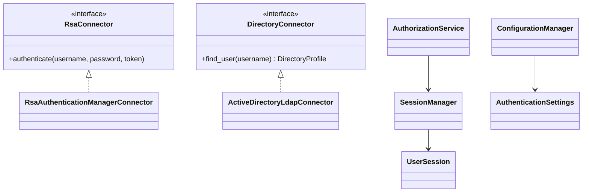

# Aerofix Service Management

Internal post-delivery drone service-management application.

## Current implementation

- React operations dashboard with customer, contract, Product Master, and incident navigation.
- FastAPI application with a versioned health endpoint, PostgreSQL persistence API, and validated API schemas for customers, sites/contacts, contracts with AMC/CMC coverage, configurable product fields, and incidents.
- PostgreSQL tables for customers, contracts, products, incidents, knowledge documents, users, assignment groups, and Microsoft Entra ID configuration.
- Docker Compose deployment with a private PostgreSQL service, API service, and web gateway on port `5173`.
- Provider-neutral enterprise authentication API with demo mode, RSA Authentication Manager and Active Directory LDAP integration boundaries, role mappings, signed sessions, and audit logging.

## Run locally

Frontend:

```powershell
Set-Location frontend
npm run dev
```

API:

```powershell
Set-Location backend
python -m uvicorn app.main:app --reload --port 8000
```

Open `http://localhost:5173` for the interface and `http://localhost:8000/docs` for the API specification. The health endpoint is `http://localhost:8000/api/v1/health`.

## Docker deployment

1. Copy `.env.example` to `.env` and replace `POSTGRES_PASSWORD` with a long, unique value. Do not commit `.env`.
2. Set the Microsoft Entra environment values in `.env` when they are available. `ENTRA_CLIENT_SECRET` is an environment-only secret and is never stored in PostgreSQL or shown in the UI.
3. Start the application:

```powershell
docker compose up --build -d
```

Open `http://localhost:5173`. The API runs only on the Docker network and is proxied by the web container under `/api`. PostgreSQL has no host port mapping.

The API runs `alembic upgrade head` and initializes secret-handling notices before it starts. On the first connected application session, the dashboard migrates its current Customers, Contracts, Product Master, Incidents, Knowledge documents, Users, and Assignment Groups to their corresponding PostgreSQL tables. Thereafter it synchronizes edits and deletions to PostgreSQL.

Useful commands:

```powershell
docker compose logs -f api
docker compose down
docker compose down -v # Removes the PostgreSQL volume; use only when deliberately resetting data.
```

## Enterprise authentication deployment

The current identity selector remains intentionally enabled for demonstrations. When `authentication_settings.enabled` is set and its provider is `rsa_ad`, `/api/v1/authentication/login` becomes the enterprise entry point and demo login is refused.

Authentication sequence:

```mermaid
sequenceDiagram
	participant B as Browser
	participant A as ALS50 API
	participant R as RSA Authentication Manager
	participant D as Active Directory LDAPS
	participant P as PostgreSQL
	B->>A: POST /authentication/login (username, password, RSA token)
	A->>R: Verify password and RSA token
	R-->>A: Authentication result
	A->>D: Query profile and memberOf groups over LDAPS
	D-->>A: Profile and groups
	A->>P: Resolve group-to-role mappings, create session, audit event
	A-->>B: Standardized token and profile response; secure cookie
```



Set these deployment secrets through the platform secret store, never in source control: a 32-byte-or-longer `AUTH_JWT_SECRET`, `LDAP_BIND_PASSWORD`, and RSA adapter credentials. Set `APP_ENV=production` for live deployments; the built-in development signing key is rejected there. LDAP must use an `ldaps://` URI. The supplied RSA connector deliberately fails closed until an organization-approved RSA Authentication Manager REST or SOAP adapter is implemented behind `RsaConnector`.

Role mappings are stored in `role_mappings`. Examples: `CN=ALS50-Administrators,OU=Groups,DC=corp,DC=example,DC=com` maps to `Administrator`; `CN=ALS50-Service-Coordinators,OU=Groups,DC=corp,DC=example,DC=com` maps to `Service Coordinator`.

Authentication responses use `{ access_token, token_type, expires_at, user }`. Errors use `detail.code` and `detail.message`; key codes are `AUTH_RATE_LIMITED`, `AUTH_PROVIDER_UNAVAILABLE`, `DIRECTORY_TLS_REQUIRED`, `DIRECTORY_UNAVAILABLE`, `AUTHORIZATION_DENIED`, and `AUTH_SECRET_MISSING`. Audit records include outcome, provider, source address, correlation ID, and mapped roles only. Passwords and RSA token values are never logged or persisted.

The lockout policy is enforced after the configured count of `AUTH_INVALID_CREDENTIALS` events within its configured interval; failed provider/configuration calls do not lock users. Authentication state-changing cookie requests use a SameSite `Secure`/`HttpOnly` session cookie and a separate double-submit CSRF cookie. Browser clients must send the CSRF value in `X-CSRF-Token`. Bearer-token API clients do not use cookie CSRF protection.

API operations: `POST /api/v1/authentication/login`, `POST /api/v1/authentication/demo-login`, `POST /api/v1/authentication/logout`, `GET /api/v1/authentication/me`, `GET|PUT /api/v1/authentication/settings`, and `GET|PUT /api/v1/authentication/role-mappings`. Settings and mapping administration must be protected by `AuthorizationService.require_any_role(..., {"Administrator"})` when the enterprise authentication middleware is applied to the remaining business routes.

The provider interfaces isolate identity systems from business logic: add Azure AD, Okta, Ping Identity, or Auth0 adapters implementing the same profile/session contract without changing the application’s customer, incident, or authorization workflows. Authentication health is available at `/api/v1/authentication/health`.

## Microsoft Entra ID SSO setup

1. In Microsoft Entra admin center, register a single-page application for this portal.
2. Add the deployed web address as a **Single-page application** redirect URI, for example `http://localhost:5173/` for local Docker testing.
3. Create or select an API registration and expose a delegated scope such as `access_as_user`.
4. Create Entra security groups for application administrators and service coordinators, then copy each group object ID.
5. Add `ENTRA_TENANT_ID`, `ENTRA_CLIENT_ID`, `ENTRA_CLIENT_SECRET`, and `ENTRA_API_SCOPE` to the deployment environment. Store the client secret in a secret manager in production.
6. In **System settings**, complete the Microsoft Entra ID form with the tenant ID, application ID, redirect URI, API scope, and group object IDs. The form persists non-secret configuration in the `entra_configuration` table.
7. Leave enforcement disabled until the application registration, redirect URI, API scope, and deployment secret have all been validated. The current form is an administrative configuration placeholder; token acquisition and API JWT enforcement are the next authentication integration step.